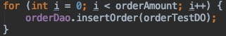
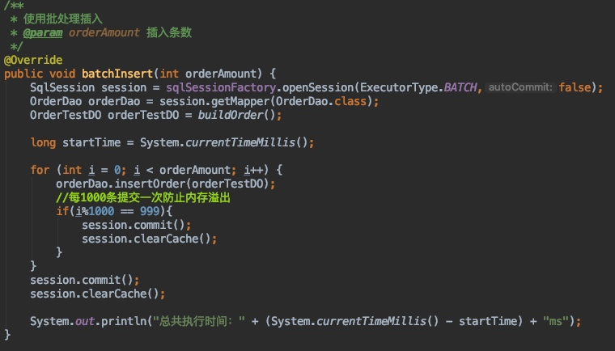

# Mybatis+mysql批量插入性能分析测试
## 前言  
今天在网上看到一篇文章（后文中的文章指的就是它） 
https://www.jianshu.com/p/cce617be9f9e  
发现了一种有关于mybatis批量插入的新方法，而且看了文章发现我原来的方法好像有点问题，但是由于文章中使用的环境是sqlserver而我经常使用的是mysql所以还是需要亲自来试试。

## 环境说明
项目使用springboot mybatis  
数据库mysql5.7  
使用本地mysql所以网络可以忽略不计  
插入对象完全相同，只有id自增  

表结构如下：  
```sql
CREATE TABLE `order_test_tab` (  
  `id` int(11) NOT NULL AUTO_INCREMENT COMMENT 'id',  
  `order_id` varchar(20) NOT NULL COMMENT '订单号',
  `order_name` varchar(100) NOT NULL COMMENT '订单名称',
  `order_status` int(1) NOT NULL COMMENT '订单状态',
  `order_content` varchar(255) NOT NULL COMMENT '订单说明',
  `add_time` datetime NOT NULL COMMENT '订单时间',
  PRIMARY KEY (`id`)
) ENGINE=InnoDB DEFAULT CHARSET=utf8 COMMENT='测试订单表';
```


## 方法说明  
我使用了和文章中提到的一样，三种方法进行测试  
方法一：  
使用for循环调用单条插入  
  
  


方法二：  
在sql中使用foreach进行批量insert  


方法三：
使用mybatis的批量插入  
  

## 结果说明
| 插入条数 | 100 | 500 | 1000 | 5000 | 100000 |
| --- | :-- | :-- | :-- | :-- | :-- |
| 使用for循环插入 | 139ms | 545ms | 839ms | 2629ms | 31157ms |
| 使用sql foreach插入 | 55ms | 119ms | 123ms | 329ms | 报错 |
| 使用批量执行插入 | 48ms | 111ms | 239ms | 1081ms | 19235ms |

其中报错是因为sql长度过长超过了max_allowed_packet导致的，报错信息如下：  
Error updating database.  Cause: com.mysql.cj.jdbc.exceptions.PacketTooBigException: Packet for query is too large (22,700,108 > 4,194,304). You can change this value on the server by setting the 'max_allowed_packet' variable.

从结果我们显然可以看出，使用第二种方式（使用sql foreach插入）效率最高，明显与文章中差距很大，所以mysql和sqlserver还是有很大区别的，估计mysql针对批量插入的语句有过优化

## 测试说明
1.测试具体插入之前，首先执行删除表中所有数据操作，一个是保证环境完全一致，一个是为了减少第一次连接数据库所带来的性能消耗。  
2.执行时间的计算就是在执行sql的前后，创建对象的时间不计算在这之内  
3.在使用本地mysql测试完成之后，使用外网服务器的mysql进行测试，测试结果基本一致，时间都略有延长  
 
## 结论
批量插入时还是使用sql foreach插入来的效率最高，因为它是整一条sql在执行所以当插入条数很多的时候会出现异常，所以使用这种方式时一定要主动限制插入的最大条数，不然容易出现异常，因为max_allowed_packet即使再打也会容易不够用。  
同时我们也应该竟可能去避免使用for循环插入数据，因为性能真的很差。


